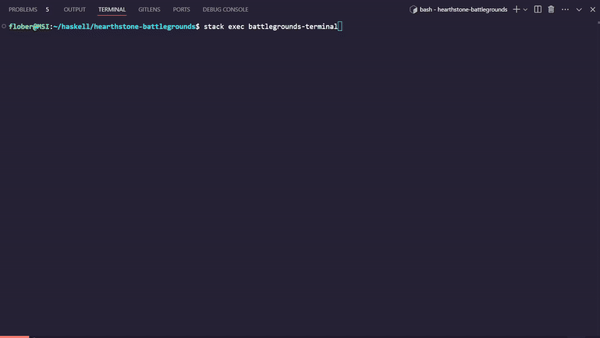

# battlegrounds
Early Work In Progress!

Overall, the architecture is MVC (Model, View, Controller) and some event-driven programming. See discussions on architecture [here](app/Model.md).

### Roadmap
##### 1. Establish the battlegrounds infrastructure.
1. Establish turn and gold system.
2. Implement shop phase. Support dummy minion in shop (one dummy minion for each tier). Randomness implemented. Shared pool not implemented.
3. Implement combat phase. Currently, just have an AI with a dummy minion.
4. Write code that supports just a single player.